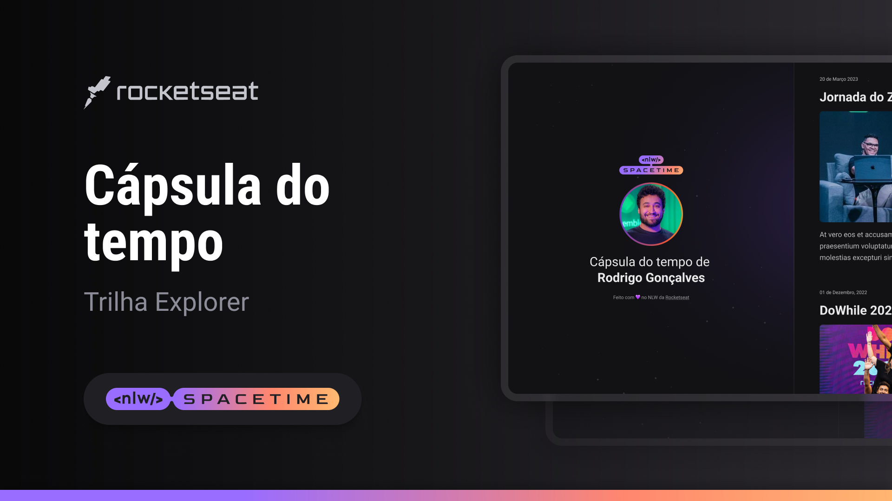

## 🖥️ Projeto

Esse é um projeto web Responsivo de uma capsula do tempo para exibir memória em uma linha do tempo.

## 🚀 Tecnologias

Esse projeto foi projeto foi desenvolvido durante o NLW da Rocketseat com as seguintes tecnologias:

- HTML
- CSS
- Git e Github

# 🏷️Layout

Você pode pode visualizar  layout do projeto através 
[desse link] (https://www.figma.com/file/09iBvm75YMnHpAaOpueOdJ/C%C3%A1psula-do-tempo-%E2%80%A2-Trilha-Explorer-(Community)?type=design&node-id=306%3A84&t=PAH9WkBwApnywalX-1).
É necessário ter uma conta no [figma](https://www.figma.com)

